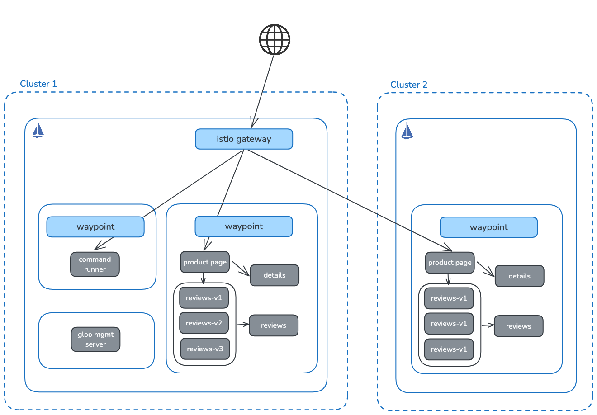
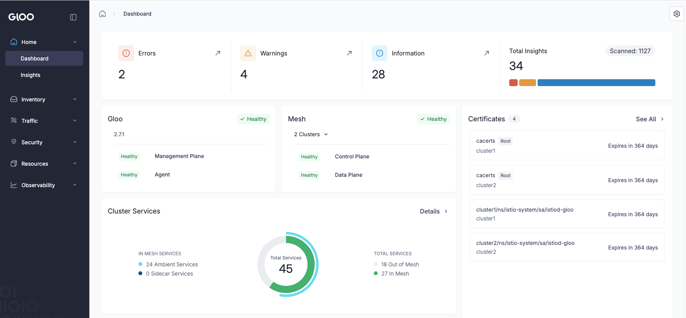

== Gloo Mesh Ambient Multi-cluster
:toc:

== Introduction

This walkthrough demonstrates a multi-cluster setup in Gloo Mesh. It goes through the following:

. Installing the Gloo Operator and Service Mesh Controller on both clusters.
. Configuring applications to use Istio Ambient mode.
. Configure multi-cluster services in Istio.
. Configuring a Gateway and associated HTTP routes for applications
. Configuring a Waypoint proxy for applications.
. Demonstrating Ambient features such as:
 .. Routing to specific application versions.
 .. Dynamic routing based on information such as headers.
 .. Isolating namespaces through authorization policies.
 .. Resiliency and fault injection.
. Installing Gloo Mesh Management Server on the 1st cluster for observability.

include::prerequisites.adoc[]

== Set Up Environment

Set the following environment variables. CLUSTER1 and CLUSTER2 should be the name of your Kubernetes contexts:

[,bash]
----
export CLUSTER1=<cluster1-context>
export CLUSTER2=<cluster2-context>
export CLUSTER1_NAME=cluster1
export CLUSTER2_NAME=cluster2
export GLOO_VERSION=2.8.1
export ISTIO_VERSION=1.25.3
export GLOO_MESH_LICENSE_KEY=<gloo-mesh-license-key>
----

Verify they're set properly:

[,bash]
----
echo "Cluster 1: $CLUSTER1"
echo "Cluster 1 Name: $CLUSTER1_NAME"
echo "Cluster 2: $CLUSTER2"
echo "Cluster 2 Name: $CLUSTER2_NAME"
echo "Gloo Version: $GLOO_VERSION"
echo "Istio Version: $ISTIO_VERSION"
----

include::sample-apps.adoc[]

include::mgmt-plane.adoc[]

include::install-istio.adoc[]

include::multicluster-services.adoc[]

include::gateway.adoc[]

include::route.adoc[]

include::waypoint.adoc[]

== Ambient Features

include::l7-routing.adoc[]

include::namespace-isolation.adoc[]

include::timeouts.adoc[]

include::workload-identities.adoc[]

== Observability

Launch the dashboard:

[,bash]
----
meshctl dashboard --kubecontext=$CLUSTER1
----

include::cleanup.adoc[]
